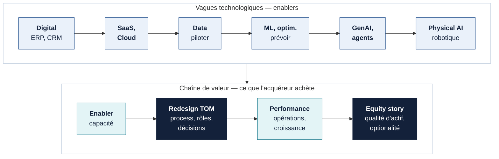

::: tldr En bref
1. **La transformation opérationnelle est déjà le métier de Hivest.** Digital, cloud, data, ML, GenAI, agents et robotique prolongent le même geste d'investisseur actif. La valeur vient de la refonte des processus, des rôles et des décisions ; la technologie seule en crée peu.
2. **Mandat portefeuille : un Centre d'Excellence qui réduit le coût et le risque de transformer.** Enablement, forward deployment et pilotage de la transformation, au service des dirigeants qui restent souverains sur leurs choix. On priorise par horizon de sortie et payback ; aucune feuille de route datée n'est défendable avec les données publiques.
3. **Mandat fonds : un processus d'investissement qui capitalise sa mémoire.** Les modèles deviennent une commodité. La mémoire des dossiers, la doctrine, les procédures et les preuves sont les actifs à construire et à gouverner, à partir d'un protocole de test sur dossiers historiques.
:::

::: kpis
- 52 % | de l'inventaire mondial buyout-backed détenu depuis plus de 4 ans en 2025, soit ≈ 16 000 sociétés[^mck]
- 40 % | des 100 investisseurs PE interrogés par BCG déclarent une décote ≥ 5 % liée à une maturité **digitale** insuffisante[^bcg1]
- 15 % | seulement des participations jugées « very mature » en IT par ces mêmes investisseurs[^bcg1]
- 0 / 10 | participations Hivest dont un ML en production est établi par les sources publiques — un inconnu, pas un constat d'absence[^ptf]
:::

## 1 — L'IA ne crée pas un nouveau métier pour Hivest : elle déplace une nouvelle fois la frontière de la transformation

Hivest reprend des entreprises familiales et des activités non stratégiques de grands groupes, puis révèle leur potentiel par la croissance et la transformation opérationnelle[^hivest]. Chaque vague technologique a suivi le même mouvement : un outil devient une capacité, puis la capacité devient un levier de valeur reconnu à la sortie.
{: .lede}

Agora Makers illustre ce geste : avec Nexiode puis Kuzzle, un industriel de l'éclairage public ajoute un pilier logiciel, IoT et data et vise davantage de revenus récurrents[^kuzzle]. La stratégie et l'opération sont publiques ; le rendement de la transformation ne l'est pas encore.

| Vague | Before — ce qui a changé | Apprentissage accumulé | Conséquence pour l'IA aujourd'hui |
|---|---|---|---|
| Digital, SaaS / Cloud | Processus outillés, puis standardisés | L'outil sans refonte du processus crée peu ; une maturité digitale faible pèse déjà sur la valorisation perçue[^bcg1] | Commencer par le processus et son owner |
| Data | Pilotage par indicateurs | Des référentiels fiables conditionnent tout le reste | Auditer les données avant le modèle |
| ML / optimisation | Prévision, maintenance, planification | Les gains se construisent avec le terrain et contre une baseline simple | Toujours comparer à une règle métier ou à Six Sigma |
| GenAI / agents | Documents, connaissance, workflows | Le passage du pilote à la production est un sujet de rôles et de gouvernance[^bcg2] | Mesurer le workflow transformé, pas l'usage |
| Physical AI / robotique | Vision, cobotique, automatisation | Le payback dépend du volume, de la variabilité et de la sécurité | Réserver aux cas où l'économie du site le justifie |

::: callout Ce que cela signifie pour Hivest
Les fonds qui accélèrent maintenant héritent de quinze ans de conduite du changement, d'architecture et de gouvernance. **La difficulté principale n'est plus d'inventer des cas d'usage ; c'est d'exécuter à l'échelle, dans des entreprises hétérogènes, avant l'horizon de sortie.**
:::

## 2 — Le contexte favorise les fonds qui prouvent la transformation tôt

Le SWOT ci-dessous s'appuie sur des sources publiques et sur les dix dossiers de recherche du portefeuille. Il pose des options de discussion ; il ne vaut pas diagnostic interne de Hivest.
{: .lede}

| | Constats | Implication pour la création de valeur et la sortie |
|---|---|---|
| **Forces** | Mandat public de transformation opérationnelle[^hivest] ; build-ups qui ajoutent déjà logiciel et data (Agora Makers)[^kuzzle] | Une histoire de transformation existe déjà ; il s'agit de la rendre démontrable |
| **Faiblesses** | Maturité data / ML non établie publiquement pour les dix participations ; 21 des 22 rôles COO / DSI recherchés non identifiés publiquement[^lead] | Impossible de classer le portefeuille par maturité sans diagnostic partagé avec les dirigeants |
| **Opportunités** | Diffusion rapide du modèle embedded chez Hg, Vista, OpenAI et Anthropic[^hg1][^vista][^openai][^anthropic] ; corpus de cas PME-ETI[^bpi] ; briques deal-tech reproductibles | Accès à des méthodes éprouvées sans devoir tout inventer |
| **Menaces** | Allongement des détentions : 6,6 ans en moyenne mondiale[^mck] ; décote liée à la maturité digitale[^bcg1] ; confidentialité citée parmi les principaux freins par les professionnels français[^fi] | La preuve de transformation doit être prête plus tôt et gouvernée |

La lecture croisée (TOWS) fait apparaître quatre options, toutes à instruire :

- **Forces × opportunités — capitaliser le geste existant.** Transformer chaque build-up en occasion de redesign du modèle opératoire, avec une méthode réutilisable d'une participation à l'autre.
- **Faiblesses × opportunités — diagnostiquer avant d'investir.** Partager avec chaque dirigeant une lecture simple en quatre systèmes : stratégie et valeur ; opérations et client ; data, technologie et architecture ; people, gouvernance et adoption.
- **Forces × menaces — préparer la preuve de sortie.** Documenter baseline, coût et résultat pendant la détention, pour que l'acquéreur puisse vérifier.
- **Faiblesses × menaces — ne pas lancer ce qui ne paiera pas.** Écarter les chantiers dont le payback dépasse l'horizon de sortie, sauf s'ils renforcent des fondations que l'acquéreur valorisera.

L'extension de la décote digitale à une décote « IA » reste une hypothèse : aucune source consultée ne la mesure directement.

## 3 — Le CoE ne décide pas à la place des participations ; il réduit le coût et le risque de transformer

Un Centre d'Excellence centralise ce qui gagne à être réutilisé et déploie localement ce qui exige du contexte. Chaque participation garde l'ownership opérationnel et ses arbitrages make / buy / partner.
{: .lede}

Le CoE porte trois casquettes distinctes :

- **Enablement et L&D** : CEO, COO, DSI, CFO, champions et citizen developers ; formations, playbooks, communautés.
- **Forward deployment** : diagnostic, redesign du workflow, prototype, build tactique, *land & scale*, puis transfert aux équipes locales.
- **Transformation** : portefeuille d'initiatives, arbitrage court terme / structurel / stratégique, modèle opératoire, conduite du changement, mesure de la valeur.

Le modèle se diffuse parce qu'il résout une tension pratique. Hg intègre de petites équipes dans ses participations via Catalyst (80+ ingénieurs, produits et designers revendiqués)[^hg1] et annonce 1 600+ projets IA live[^hg2]. Vista associe des forward-deployed engineers de Google Cloud à sa Value Creation Team pour 90+ sociétés[^vista]. OpenAI et Anthropic ont créé en mai 2026 des structures dédiées au déploiement embedded, la seconde ciblant explicitement les entreprises de taille moyenne avec un consortium de gestionnaires d'actifs alternatifs[^openai][^anthropic]. Ces portefeuilles sont surtout logiciels : le modèle se transpose, les solutions techniques non.

<figure class="swim">

Détecter · diagnostiquer

Prioriser

Land · prove

Scale · transfer

RETEX · reuse

CoE Hivest

Veille, benchmarks, grille en 4 systèmes

Quadrant sortie × payback

Playbooks, market views make / buy / partner

L&amp;D, communauté de champions

Capitaliser le RETEX, réutiliser

Équipe forward

Diagnostic terrain avec le métier

Baseline et business case

Redesign, prototype, build tactique

Transfert, documentation

Rétro de mission

CEO · COO · CIO

Pose le problème business

Arbitre et sponsorise

Décide make / buy / partner

Porte l'objectif de valeur

Valide la preuve

Champions · métiers

Décrivent le workflow réel

Priorisent les irritants

Testent, ajustent

Adoptent, forment leurs pairs

Remontent les usages

DSI · plateformes

Cartographie SI et données

Faisabilité, sécurité

Environnement, accès, IAM

Industrialise, observe, maintient

Composants réutilisables

Écosystème

Éditeurs, intégrateurs, experts

Contrats, SLA

<figcaption><b>Figure 2</b>Operating contract du CoE — chaque rôle agit à chaque étape ; le lien RETEX → réutilisation transforme des missions locales en capacité de portefeuille</figcaption>
</figure>

L'IA déplace aussi la frontière entre IT et métiers : davantage d'enablement et de personnalisation au plus près de l'activité ; architecture capitalisable, cybersécurité, IAM, observabilité, passerelles de modèles et composants réutilisables mutualisés. Le prisme reste large : data, analytics, optimisation, Six Sigma, forecasting, ML, maintenance prédictive, vision, GenAI, agents, automatisation et robotique.

## 4 — Prioriser par l'horizon de sortie : une petite preuve matérialisable vaut mieux qu'un grand ROI hors horizon

Le temps de détention restant, le payback et la magnitude décident de l'ordre ; la maturité, le sponsorship, la donnée et la capacité d'exécution sont des contraintes. Un ROI théorique élevé dont le payback dépasse la sortie pèse moins qu'un gain plus petit visible dans l'equity story.
{: .lede}

<figure class="quad">

Temps de détention restant

Long · payback court<b>Seed &amp; learn</b>Quick wins qui financent l'apprentissage et installent baseline et owners.

Long · payback long<b>Transformer</b>Refonte structurelle du modèle opératoire ; jalons de preuve annuels.

Court · payback court<b>Prouver pour l'exit</b>Gains mesurés et documentés dans la dataroom de sortie.

Court · payback long<b>Préparer, ne pas lancer</b>Fondations data lisibles pour l'acquéreur ; pas de chantier lourd.

Payback / time-to-value →

<b>Magnitude</b> : taille de la valeur en annotation de chaque cas. <b>Contraintes</b> : sponsorship, données, capacité d'exécution, dépendances. <b>Stop</b> : pas de baseline, pas d'owner, ou payback au-delà de la sortie sans valeur de fondation.

<figcaption><b>Figure 3</b>Règle de priorisation — quadrants de décision, pas feuille de route datée</figcaption>
</figure>

Le portefeuille ne peut être placé que sur l'axe du temps. Les mois d'entrée affichés par Hivest donnent une ancienneté observable, pas un horizon de sortie ; la maturité et la capacité d'exécution restent inconnues pour chaque société[^ptf]. Les trois périodes ci-dessous sont analytiques, pas des durées universelles.

| Période analytique | Participations (mois d'entrée) | Thèses dominantes des dossiers publics | Signal Data / ML public |
|---|---|---|---|
| **Buy-in & seed** (< 2 ans) | VMI-Jokon (07/26), Novasol (12/25), Sphere (12/24), NV Labs (12/24) | Build-up à deux chaînes ; marge de distribution ; intégration d'une plateforme industrielle ; qualité et traçabilité des lots | Aucun ML en production établi ; systèmes à cartographier |
| **Transform** (2–5 ans) | Reunimer (07/24), Marie-Laure PLV (12/23), CCE Group (05/23), Agora Makers (05/22) | Traçabilité multi-filiales ; intégration post-acquisitions ; build-up aéronautique ; industriel + logiciel | Offres connectées **déclarées** chez CCE (SmartULD) et Agora (Nexiode, Kuzzle) ; ML en production inconnu |
| **Pay-off & exit readiness** (> 5 ans) | STG (11/18), Aurightec (07/17) | Coût de service transport ; marge et qualité après carve-out | Plateforme IA **déclarée** par Aurightec China, gains non audités ; TMS / télématique STG inconnus |

::: callout-gold Ce que le portefeuille ne dit pas encore
L'horizon de sortie réel, la maturité data / ML et les owners COO / DSI ne sont pas publics. **Aucun placement de maturité n'est proposé** : il se construit avec chaque dirigeant, par un diagnostic partagé.
:::

RuptureJusqu'ici : transformer les participations. <b>Maintenant : transformer l'outil d'investissement lui-même.</b>

## 5 — L'investissement augmenté commence par un protocole de preuve, puis par une mémoire

Même sponsor, méthodes partagées, comptes de valeur séparés. Pour le fonds, l'enjeu est la qualité et la vitesse de décision, à confidentialité maîtrisée.
{: .lede}

::: story Garde-fou avant tout outil
Tester à l'aveugle sur 30 à 50 dossiers historiques autorisés — refusés, perdus, acquis. Mesurer le temps **vérification comprise**, la couverture documentaire, le désaccord analyste / machine, les risques détectés et le coût complet. Plus de synthèses n'est pas un résultat d'investissement.
:::

OriginationScreeningDue diligenceIC · closingHold · monitoringExit

À terme, un **Second Brain Hivest** relierait ces étapes. C'est une hypothèse de design, pas une capacité existante : mémoire des deals vus, motifs de refus et de réouverture, procédures et KYC, doctrine d'investissement, contradictions de diligence, comparables, décisions de comité, plan vs réel, RETEX de sortie.

| Friction | Capacité recherchée | Pattern reproductible | Exemple marché (périmètre) |
|---|---|---|---|
| Dossiers dispersés, antériorités perdues | Retrouver deals, refus et contacts | Recherche sous permissions, sources citées | Sinequa : connecteurs, RAG ; promesses de performance exclues[^sinequa] |
| Lecture de CIM, comptes hétérogènes | Normaliser et comparer | Extraction financière avec lignage vers le document | Corporatings : données publiées, surtout sociétés cotées[^corp] |
| Dataroom volumineuse | Couvrir, rapprocher, tracer | Document → structure → graphe → analyse traçable | DilBloom : capacités décrites ; chiffres vendeur non retenus[^dil] |
| Reporting et suivi manuels | Collecter, valider, alerter | Document operations et data product alternatifs | Accelex (Carta), Canoe : côté LP et allocataires[^accelex][^canoe] |

Ces exemples forment un catalogue de patterns, pas une shortlist. Pour un fonds mid-cap, certaines plateformes sont disproportionnées : on teste d'abord si le pattern se reproduit en build léger, incrémental et gouverné.

## 6 — Le modèle devient une commodité ; la mémoire, la doctrine et les preuves sont l'actif à gouverner

Les modèles changeront plusieurs fois pendant la vie d'un fonds ; doctrine, procédures, mémoire des dossiers et preuves doivent leur survivre.
{: .lede}

<figure class="twin">

<b>Décision &amp; expérience</b>associés, deal teams, comité

<b>Workflows / agents</b>screening, DD, suivi, exit

<b>Skills / procédures</b>checklists, KYC, playbooks

<b>Doctrine d'investissement</b>règles, critères, cadre normatif

<b>Mémoire longue des deals</b>refus, décisions, RETEX

<b>Mémoire de travail</b>dossier en cours, contradictions

<b>Données</b>portefeuille + sources externes

<b>Modèles &amp; infrastructure</b>remplaçables

Actif propriétaire doit survivre aux changements de modèle ; lignage, droits et revue humaine.

Commodité choisie par classe de données, révisable.

<figcaption><b>Figure 4</b>Investment Digital Twin — architecture cible en couches, à construire et gouverner</figcaption>
</figure>

La souveraineté est un arbitrage d'architecture : cloud public ou privé, open-weight, on-prem et passerelles se choisissent par classe de données.

| Critère | Question à trancher |
|---|---|
| Classe de données et privilège | Dataroom sous NDA, données personnelles, legal privilege, informations LP : qui peut voir quoi ? |
| Traçabilité et contrôle | Lignage, RBAC / ABAC hérités de la VDR, journal d'accès, observabilité |
| Coût, latence, réversibilité | Coût complet, performance utile, sortie possible sans perte de mémoire |
| Portabilité des modèles | Changer de modèle sans réécrire doctrine, procédures et mémoire |

## 7 — Un rôle, deux mandats : un sponsor commun, des comptes de valeur séparés

Une fonction transversale d'enablement rattachée aux associés, qui accélère plans stratégiques et intégrations post-build-up sans se substituer aux dirigeants. Titre de travail : Head of AI / AI Transformation CoE, à ajuster au recrutement réel.
{: .lede}

| | Mandat portefeuille | Mandat fonds |
|---|---|---|
| **Ce que porte Hivest** | Transformation des actifs | Excellence du processus d'investissement |
| **Ce que j'apporte** | Transformation, operating model IA et produit | Expérience buy-side et build IA |
| **Ce que le poste construit** | CoE et forward deployment | Investment intelligence et Second Brain |
| **Preuve attendue** | Gain mesuré dans l'equity story | Qualité et vitesse de décision vérifiées |

::: story Retour d'expérience personnel
Chez Amundi, à l'interface des équipes d'investissement, des données et de la gouvernance : qualifier un flux de demandes métier, choisir une architecture sous contrainte de confidentialité, construire des outils IA, les passer à l'échelle et mesurer l'adoption. Se transfèrent la méthode de qualification, la discipline de gouvernance et le réseau d'owners ; pas la plateforme elle-même. Réalisations chiffrées à partager en entretien.
:::

::: callout-gold Option de services : un dézoom, pas un objectif
KKR rapporte pour 2025 113,6 M$ de frais et 100,0 M$ de charges attribuables à Capstone[^kkr], sans marge transposable. Une offre facturable ne s'examinerait qu'après preuve de valeur, avec les LP, la conformité et un conseil juridique.
:::

**Trois questions pour une discussion d'associés**

1. Hivest considère-t-il Data / ML / IA comme une composante de la transformation opérationnelle et, à terme, de l'equity story ?
2. Où placer la frontière entre capacités mutualisées du fonds et souveraineté des participations ?
3. Quel niveau d'ambition justifie une capacité permanente plutôt qu'une succession de missions externes ?

[^hivest]: Hivest, « Hivest II atteint son hard cap de 300 M€ », 1er septembre 2022.
[^kuzzle]: Hivest, « Acquisition de Kuzzle par Agora Makers », 20 mars 2026 ; aucun ROI publié.
[^bcg1]: BCG, *Private Equity's Future Is Digital First and AI Powered*, 2026 ; 100 investisseurs, déclaratif ; maturité digitale, pas IA.
[^bcg2]: BCG, *Inside the AI-First Private Equity Firm*, janvier 2026 ; jugement analytique du cabinet.
[^mck]: McKinsey, *Beating the odds: how private equity firms can improve exit prospects*, 2026, d'après PitchBook ; décrit un inventaire d'actifs, pas une proportion de fonds.
[^ptf]: Hivest, page portefeuille (mois d'entrée affichés, ≠ closing), 23 septembre 2026 ; dossiers de recherche publics des dix participations, même date.
[^lead]: Registre public des dirigeants, 23 septembre 2026 : 22 rôles COO / DSI, un seul vérifié (filiale) ; absence de preuve ≠ vacance.
[^hg1]: Hg, « Hg launches Catalyst, a new AI incubator », 17 novembre 2025 ; chiffres déclarés par Hg.
[^hg2]: Hg, « Hg extends collaboration with Anthropic », 21 septembre 2026 ; chiffres déclarés, impact budgété.
[^vista]: Vista Equity Partners, partenariat Google Cloud, 22 avril 2026.
[^openai]: OpenAI, « OpenAI launches the Deployment Company », 11 mai 2026 ; source fournisseur.
[^anthropic]: Anthropic, « Enterprise AI services company », 4 mai 2026 ; source fournisseur, sans montant publié sur la page.
[^bpi]: Bpifrance Conseil et Siparex, *Les audacieux de l'IA : 20 cas d'usage*, 2026 ; pourcentages non repris faute de fragment primaire.
[^fi]: France Invest, *L'IA dans le capital-investissement : état des lieux 2024*, 2025 ; déclaratif ; chiffre non repris faute de recapture du PDF.
[^sinequa]: Sinequa by ChapsVision, *Sinequa for Private Equity* ; description éditeur.
[^corp]: Corporatings, solution Lens ; couverture du non coté à ne pas supposer.
[^dil]: DilBloom, dilbloom.ai ; capacités décrites par l'éditeur, performances non vérifiées.
[^accelex]: Carta, acquisition d'Accelex, 2 octobre 2025 ; offre LP Portfolio Analytics.
[^canoe]: Canoe Intelligence, page Solutions ; clientèle surtout allocataires, asset servicers, wealth managers.
[^kkr]: KKR & Co., rapport annuel 2025 (10-K, SEC) ; structure propre à KKR.
