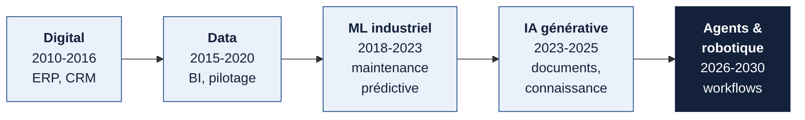
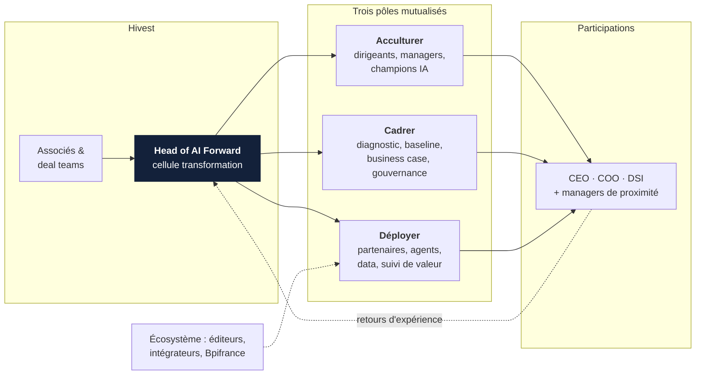
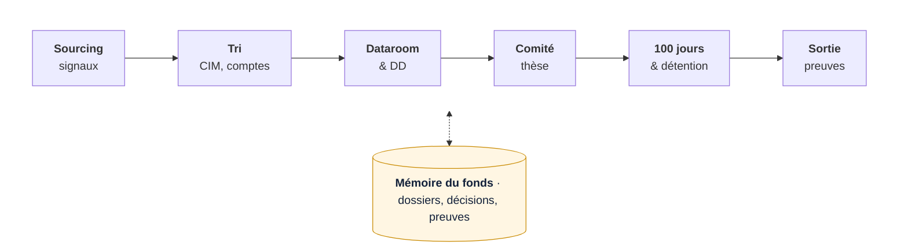
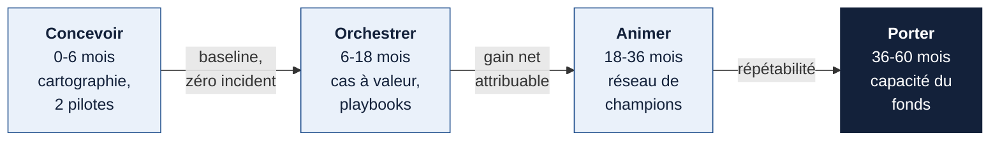

::: tldr En bref
1. **La transformation est la vocation de Hivest.** Reprendre des entreprises familiales et des carve-outs, puis libérer leur potentiel par la croissance et la transformation opérationnelle : le digital, la donnée, la maintenance prédictive et aujourd'hui l'IA prolongent ce même geste d'investisseur actif.
2. **Deux chantiers se renforcent.** Le *forward deployment* place une capacité de transformation au plus près des dirigeants des participations. L'*investissement augmenté* accélère le sourcing, la lecture des datarooms et la décision, dans un marché où les transmissions vont se multiplier.
3. **Le moment est favorable et le risque maîtrisable.** L'écosystème est mûr, les pairs américains ont ouvert la voie et les fonds ont déjà traversé trois vagues de transformation. La clé tient à l'empowerment des managers, à la confidentialité des données et à une montée en charge par preuves.
:::

::: kpis
- 370 000 | entreprises françaises à transmettre d'ici 2030, dont 130 000 attendues sur 5 ans[^bpi]
- 76 % | des professionnels du capital-investissement citent la confidentialité comme premier frein à l'IA[^fi]
- 73 % / 22 % | des fonds mènent une diligence digitale ; 22 % en font un critère go/no-go[^bcg1]
- 5,5 Md$ | levés en mai 2026 par les sociétés de déploiement IA d'OpenAI et d'Anthropic, soutenues par de grands GP[^tdc]
:::

## 1 — La transformation, métier historique du LBO actif

Hivest affiche une mission claire : aider les entreprises à révéler leur plein potentiel par des stratégies de croissance innovantes et l'accompagnement de transformations opérationnelles[^hivest]. L'IA s'inscrit dans cette continuité.
{: .lede}

Le fonds cible des entreprises de 50 à 500 M€ de chiffre d'affaires, familiales ou issues de carve-outs, avec des équipes aux profils d'investisseurs et d'entrepreneurs[^hivest]. Son portefeuille est majoritairement industriel et B2B. Le rachat de Kuzzle par Agora Makers en mars 2026 illustre déjà la trajectoire : un industriel de l'éclairage public fondé en 1837 ajoute une plateforme logicielle IoT et data souveraine pour accroître ses revenus récurrents[^kuzzle].

Chaque vague technologique a suivi le même mouvement : un outil devient une capacité, puis la capacité devient un levier de valeur reconnu à la sortie.

\newpage

| Vague | Ce que le marché a appris | Retour d'expérience public |
|---|---|---|
| Digital | La valeur vient de la refonte des processus ; l'outil seul crée peu. | 40 % des investisseurs ont subi une décote de valorisation de 5 % ou plus pour maturité digitale insuffisante[^bcg1]. |
| Data | Une donnée fiable conditionne le pilotage et le ML. | Seules 15 % des participations déclarent une IT « très mature »[^bcg1]. |
| ML industriel | Les gains se construisent avec les ingénieurs terrain. | SLB : −55 % de temps d'arrêt, disponibilité de flotte de 84 % à 93 %, avec une équipe mixte de 20 personnes[^slb]. Michelin : 1 500 utilisateurs Dataiku sur plus de 50 usines[^dku]. |
| Observabilité | La coordination humaine produit l'essentiel du gain. | Toyota Motor North America : résolution d'incident usine ramenée de 7 jours à 2 heures[^ddog]. |
| IA générative et agents | Le passage du pilote à la production est un sujet de gouvernance. | BCG : la plupart des fonds ne montrent pas encore de retour significatif ; la valeur vient de la refonte des rôles et des workflows[^bcg2]. |

::: callout Ce que cela signifie pour Hivest
Les fonds qui démarrent maintenant héritent de quinze ans de retours d'expérience. La trajectoire est progressive, l'écosystème est outillé et les erreurs types sont documentées. **Hivest peut avancer vite parce qu'il avance sur un terrain connu.**
:::

## 2 — Drivers de marché et drivers internes à 3-5 ans

La synthèse de la recherche fait converger cinq thèmes. Le tableau indique le nombre de sources indépendantes qui les étayent.

| Thème | Convergence | Constat | Implication pour un fonds mid-cap |
|---|---|---|---|
| Du pilote à la refonte des workflows | 5 sources | BCG oppose *deploy*, *reshape* et *invent*[^bcg2] ; 20 cas Siparex-Bpifrance, 80 % déployables en moins de six mois[^sip]. | Prioriser la refonte des processus et des rôles dans les participations. |
| La valeur se joue avant le deal | 4 sources | 73 % des fonds font une diligence digitale, 22 % en font un critère de décision[^bcg1]. | Intégrer la maturité data/IA à la thèse et au plan de valeur dès la diligence. |
| Dealflow en hausse, équipes constantes | 3 sources | 370 000 transmissions potentielles d'ici 2030 ; 40 % des dirigeants interrogés veulent céder sous 5 ans[^bpi]. | Qualifier plus de dossiers sans diluer le jugement de l'équipe d'investissement. |
| Le logiciel deal-tech se consolide | 4 sources | Sinequa racheté par ChapsVision, Accelex par Carta (2025) ; accord de rachat de Canoe par Bloomberg (2026)[^sinequa][^accelex][^canoe]. | Assembler des briques éprouvées ; exiger réversibilité et localisation des données. |
| Confidentialité, souveraineté, gouvernance | 4 sources | Confidentialité : premier frein pour 76 % des répondants France Invest[^fi] ; sécurité : 67 % chez Deloitte[^dtt]. | Faire de la maîtrise des données un avantage compétitif du fonds. |

::: cols
### Drivers de marché

- **Pression démographique** sur la transmission des PME et ETI françaises.
- **Maturité du marché logiciel** : outils spécialisés PE, agents, plateformes data industrielles.
- **Pairs américains** qui industrialisent le déploiement IA à l'échelle du portefeuille.
- **Exigences des LP et des acquéreurs** : une histoire de transformation documentée soutient le multiple de sortie.
- **Cadre réglementaire** : AI Act, DORA pour les gestionnaires de FIA, doctrine CNIL sur la sous-traitance.
+++
### Drivers internes à Hivest

- **Une thèse déjà transformationnelle** : croissance, carve-outs, build-ups.
- **Un portefeuille industriel** où la donnée machine, qualité et supply chain est un gisement concret.
- **Une équipe resserrée** : chaque heure d'analyse libérée se réinvestit dans la relation dirigeant.
- **Des build-ups** qui demandent d'intégrer des systèmes, des données et des équipes.
- **Un récit de sortie** à étayer par des preuves longitudinales de transformation.
:::

## 3 — Forward deployment : le fonds actif au plus près des dirigeants

Le forward deployment consiste à placer une capacité de transformation dans les participations, aux côtés des dirigeants, avec des méthodes et un réseau que le fonds mutualise d'une entreprise à l'autre.
{: .lede}

Le terme vient de Palantir, qui installait ses ingénieurs chez le client ; en 2026, le modèle rejoint le capital-investissement.

| Acteur | Modèle | Ce qu'il enseigne |
|---|---|---|
| Vista Equity Partners (US) | *Agentic AI Factory* pour plus de 90 sociétés ; partenariat Google Cloud d'avril 2026 avec ingénieurs *forward-deployed* aux côtés de la Value Creation Team[^vista]. | Un dispositif central au service de toutes les participations, adossé à des partenaires technologiques. |
| Hg (UK) | *Hg Catalyst* lancé en novembre 2025 : plus de 80 ingénieurs, produits et designers intégrés aux participations ; plus de 15 produits IA lancés, 130 M$ d'EBITDA revendiqués[^hg]. | Les revenus restent dans les participations ; le fonds capte la valeur par le multiple. |
| Blackstone, KKR (US) | Équipes Portfolio Operations et Data Science ; KKR Capstone compte environ 100 opérationnels[^bx][^kkr]. En mai 2026, discussions avec Google pour un accès direct aux modèles à l'échelle du portefeuille[^pew]. | L'opérationnel devient une fonction de premier rang du GP. |
| OpenAI, Anthropic (US) | Mai 2026 : *The Deployment Company* d'OpenAI (4 Md$, avec TPG, Bain Capital, Advent, Brookfield) et une société de services Anthropic (1,5 Md$, avec Blackstone, H&F, Apollo, General Atlantic) dédiée au mid-market[^tdc]. | Les GP investissent dans le déploiement IA : nouveau relais de revenus et d'accès pour leurs participations. |
| Siparex × Bpifrance (FR) | Ouvrage d'avril 2026 : 20 cas en PME-ETI de 1,5 à 2 700 M€ de CA, méthode issue de plus de 1 500 accompagnements ; 70 % des projets entre 15 k€ et 100 k€[^sip]. | Le modèle est transposable au mid-market français avec des budgets proportionnés. |
| AI Partners (FR) | Trois pôles : **AI Academy** (acculturer, former des champions), **AI First Organization** (diagnostic, business case, gouvernance), **AI Factory** (agents en production). Modèle d'expert dédié chez Vetoquinol avec revues d'impact trimestrielles[^aip]. | Une grille de packaging éprouvée : acculturer, cadrer, déployer, puis accompagner dans la durée. |

::: callout Trois messages pour les associés
- **Les grandes transformations demandent de l'empowerment managérial plus que de l'agent.** Chez MAIF, dix ans d'IA en production reposent sur une règle : construire avec les équipes terrain, assister avant d'automatiser[^aip]. Le rôle de la cellule est de rendre chaque CEO et chaque manager propriétaire de sa transformation.
- **Les enjeux sont lourds et la trajectoire est connue.** Les fonds qui démarrent en 2026 s'appuient sur les retours des vagues digitale, data et maintenance prédictive, sur un écosystème mature et sur des pairs qui ont déjà payé l'apprentissage.
- **Un nouveau relais de revenus est possible, sous conditions.** Trois comptes restent distincts : la valeur créée dans la participation, la performance du fonds pour les LP, et une éventuelle rémunération de services par le GP.
:::

::: callout-gold Revenus de services : ce que montrent les exemples américains
KKR comptabilise des *consulting fees* facturés aux participations[^kkrsec] ; Blackstone réduit les management fees payés par ses investisseurs d'une part des honoraires perçus des participations[^bxsec]. Hg fait le choix inverse et laisse les revenus IA dans les sociétés[^hg]. Pour Hivest, la séquence la plus robuste consiste à prouver d'abord la valeur dans les participations, puis à examiner un modèle de services avec les LP, la conformité et un conseil juridique.
:::

## 4 — Investissement augmenté : accélérer la chaîne de décision

La vague de transmissions va multiplier les dossiers à qualifier. L'IA permet d'en traiter davantage à équipe constante ; la décision reste aux professionnels de l'investissement.
{: .lede}

Les professionnels du capital-investissement attendent les gains d'abord sur le sourcing (71 %), puis sur le suivi de portefeuille et le deal live (61 % chacun)[^fi]. Aux États-Unis, 86 % des dirigeants corporate et PE interrogés par Deloitte ont intégré l'IA générative à leurs workflows M&A[^dtt].

| Étape | Friction actuelle | Accélérateur | Solutions observées sur le marché |
|---|---|---|---|
| Sourcing | Signaux dispersés, CRM incomplet, doublons | Détection de signaux de transmission, dédoublonnage, historique relationnel | Recherche d'entreprise cognitive (Sinequa by ChapsVision)[^sinequa] |
| Qualification | Lecture des CIM, retraitement des comptes | Extraction et normalisation sourcées, comparables | Corporatings (Paris) : données financières de plus de 15 000 émetteurs, traçables jusqu'au document[^corp] |
| Dataroom et DD | Volume documentaire, versions, Q&A | Recherche sous permissions, rapprochement contrats-comptes-KPI, citations | DilBloom : analyse de datarooms, de la donnée brute à la décision[^dil] ; Sinequa[^sinequa] |
| Comité | Hypothèses peu tracées | Dossier qui relie claim, document et hypothèse ; red team de la thèse | Cadres de conseil BCG et Deloitte[^bcg3][^dtt] |
| Détention et reporting | Collecte manuelle des KPI et documents | Extraction automatique, alertes d'écart | Accelex (Carta)[^accelex], Canoe (1,5 M de documents par mois, 44 000 fonds)[^canoe] |

::: story Un garde-fou issu de la recherche
McKinsey a comparé des diligences *outside-in* produites par IA générative à des entretiens d'experts : dans 7 secteurs sur 10, l'IA était nettement plus optimiste, et environ 40 % des données clés des experts manquaient, sans pouvoir être récupérées par de nouveaux prompts[^mck]. **L'IA accélère la préparation ; l'expertise humaine et les données propriétaires font la décision.**
:::

### Souveraineté et confidentialité : un avantage à construire

Une dataroom réunit secrets d'affaires, données personnelles et clauses de confidentialité imposées par le vendeur. La maîtrise de ces flux conditionne l'accès aux meilleurs dossiers.

- **Cloisonnement** par transaction et par participation, droits hérités de la VDR, journal d'accès.
- **Localisation et réversibilité** des données : hébergement européen, portabilité, clauses de sous-traitance conformes aux recommandations de la CNIL.
- **Conformité** : DORA s'applique aux gestionnaires de FIA depuis janvier 2025 ; l'AI Act monte en charge jusqu'en 2027.
- **Tests de fuite** entre dossiers avant tout passage à l'échelle, et arrêt immédiat en cas d'incident.

::: story Retour d'expérience — pré et post-deal
Mon passage chez Amundi ARA m'a placé à l'interface des équipes d'investissement, des données et de la gouvernance : qualification des demandes métier, choix d'architecture sous contrainte de confidentialité, passage à l'échelle d'outils IA et mesure de l'adoption. Ces enjeux pré et post-deal sont ceux d'un fonds de LBO ; les réalisations et chiffres précis sont à partager en entretien.
:::

## 5 — Trajectoire à 3-5 ans et mandat proposé

La montée en charge se fait par étapes, chacune conditionnée par une preuve. Le poste évolue avec elle : d'abord concevoir et orchestrer, ensuite animer un réseau, enfin porter une capacité reconnue du fonds.
{: .lede}

| Horizon | Livrables | Preuve pour passer à l'étape suivante |
|---|---|---|
| 0-6 mois | Cartographie du processus d'investissement ; pilote documentaire sur un dossier clos et un dossier vivant ; deux participations volontaires diagnostiquées avec leurs dirigeants | Zéro incident de confidentialité ; baseline mesurée ; sponsors identifiés |
| 6-18 mois | Deux à quatre cas à valeur vérifiée ; playbook diligence → 100 jours → exploitation ; acculturation des équipes de direction | Gain net attribuable (EBITDA, cash, risque évité) ; transfert aux équipes locales |
| 18-36 mois | Capacité partagée à l'échelle du portefeuille ; réseau de champions ; doctrine données et sécurité ; dossiers de sortie étayés | Répétabilité entre secteurs ; autonomie des dirigeants |
| 36-60 mois | Choix du modèle : équipe interne, partenariats, éventuelle offre de services | Accord des LP, gouvernance des conflits d'intérêts, demande externe vérifiée |

\newpage

### Alignement réciproque

| Ce que porte Hivest | Ce que j'apporte | Ce que le poste construit |
|---|---|---|
| Vocation de transformation opérationnelle | Pratique de la transformation IA en entreprise : cadrage, gouvernance, passage à l'échelle | Une méthode réutilisable d'une participation à l'autre |
| Dirigeants responsables de leur exécution | Posture d'orchestrateur : empowerment des managers, partenaires choisis au cas par cas | Des CEO et managers autonomes sur leurs cas d'usage |
| Exigence de confidentialité et de rigueur | Expérience buy-side et connaissance des enjeux pré et post-deal | Une chaîne d'investissement plus rapide et traçable |
| Horizons de détention de plusieurs années | Maturité pour porter un poste dans la durée et le faire évoluer | Une capacité qui grandit avec le fonds et ses prochains véhicules |

::: callout Proposition de discussion
Un **Head of AI Forward** rattaché aux associés, avec un double mandat : augmenter la chaîne d'investissement et accompagner la transformation des participations. La structure reste légère, les partenaires sont mobilisés au cas par cas et chaque étape s'ouvre sur une preuve de valeur. **Ce mandat prolonge le récit de Hivest : aider les entreprises à franchir un cap, en donnant plus de prise à leurs équipes de direction.**
:::

**Trois questions pour l'échange**

1. Où se situe aujourd'hui le principal goulot : dans le choix des dossiers ou dans la transformation après acquisition ?
2. Qui porte le mandat de création de valeur transverse, et avec quel pouvoir d'arbitrage auprès des dirigeants ?
3. Quelle preuve de transformation Hivest souhaite-t-il pouvoir montrer aux acquéreurs et aux LP à la sortie ?

[^hivest]: Hivest Capital Partners, « Hivest II atteint son hard cap de 300 millions d'euros », 2022 ; hivestcapital.com.
[^kuzzle]: Hivest, « Acquisition de Kuzzle par Agora Makers », 20 mars 2026.
[^bcg1]: BCG, *Private Equity's Future Is Digital First and AI Powered*, janvier 2026 (enquête auprès de 100 investisseurs).
[^bcg2]: BCG, *Inside the AI-First Private Equity Firm*, 2026.
[^bcg3]: BCG, *AI Is Turning M&A into a High-Impact Learning Machine*, juin 2026.
[^fi]: France Invest, *L'IA dans le capital-investissement : état des lieux 2024*, mars 2025 (répondants du secteur, déclaratif).
[^bpi]: Bpifrance Le Lab, *Transmission et reprise d'entreprise : perspectives de marché*, novembre 2025 (≈ 5 000 dirigeants de TPE, PME et ETI).
[^dtt]: Deloitte, *2025 GenAI in M&A Survey*, 1 000 dirigeants corporate et PE aux États-Unis, 1er semestre 2025.
[^mck]: McKinsey, *Harnessing the power of gen AI in private markets*, 5 janvier 2026.
[^sip]: Siparex et Bpifrance, *Adopter l'IA dans son entreprise : 20 cas d'usage concrets*, 29 avril 2026.
[^slb]: Dataiku, témoignage SLB, 21 septembre 2026 (résultats déclarés par les parties).
[^dku]: Dataiku, page Manufacturing, témoignage Michelin.
[^ddog]: Datadog, étude de cas Toyota Motor North America.
[^vista]: Vista Equity Partners, *Agentic AI Factory*, juin 2025 ; communiqué Google Cloud × Vista, 22 avril 2026.
[^hg]: Hg, « Hg launches Catalyst: a new AI incubator », 17 novembre 2025 (chiffres déclarés par Hg).
[^bx]: Blackstone, Portfolio Operations et Blackstone Data Science, blackstone.com.
[^kkr]: KKR, page KKR Capstone, kkr.com.
[^pew]: Private Equity Wire, « Blackstone, KKR explore Google AI partnerships », 6 mai 2026.
[^tdc]: BeBeez International, 7 mai 2026, sur les annonces OpenAI et Anthropic du 4 mai 2026.
[^kkrsec]: KKR & Co., rapport annuel 2025 (SEC), note sur la reconnaissance des revenus : *consulting fees*.
[^bxsec]: Blackstone, rapport annuel 2025 (SEC), note sur les *management fee offsets*.
[^aip]: AI Partners, weareaipartners.com : pages AI Academy, AI First Organization, AI Factory, 22 études de cas, blog (épisode MAIF, gouvernance des agents) et livre blanc *Generative AI Adoption Framework* ; site parcouru intégralement le 24 septembre 2026. Chiffres clients déclaratifs.
[^sinequa]: Sinequa by ChapsVision, *Sinequa for Private Equity*.
[^corp]: Corporatings, solution Lens ; Tech.eu, levée de 2 M€, septembre 2022.
[^dil]: DilBloom, dilbloom.ai ; annuaire Minalogic.
[^accelex]: Carta, communiqué d'acquisition d'Accelex, 2 octobre 2025.
[^canoe]: Goldman Sachs Asset Management, communiqué du 29 juillet 2026 sur l'acquisition de Canoe Intelligence par Bloomberg.