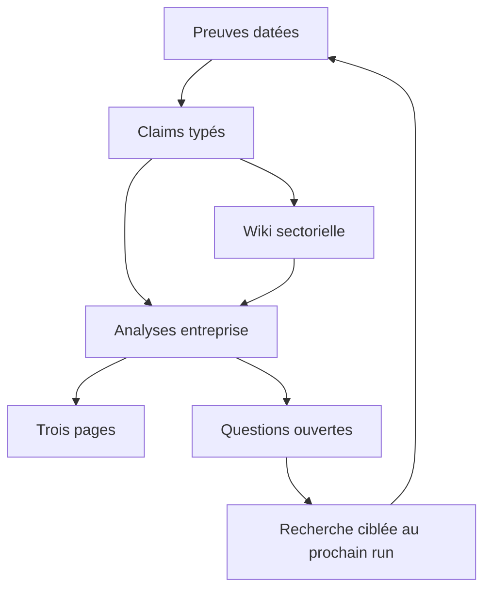

# Loopback Sphere — v0.3 —23 septembre2026

## Décision d’architecture
Adopter une wiki cumulative avec graphe de dépendances et questions, pas un rapport-monolithe comme mémoire primaire. Conserver un découpage par question stable et un index court. Une arborescence très profonde et des centaines de fragments minuscules augmenteraient le coût de navigation et les risques d’oubli. La mind map rend les liens visibles ; le routeur prépare les tâches, il ne recherche pas en arrière-plan.

## Réparations et critères de non-régression
| Défaut observé | Réparation | Critère |
|---|---|---|
| Tests de contrats sans dossier | Package réel v0.2 et test intégration | Le test charge Sphere et échoue si lien/hash cassé |
| Rapport concaténé,thèses divergentes | Modules canoniques + composeur | Une thèse d’ouverture ; sorties régénérées |
| Secteur mélangé à entreprise | Wiki limitée aux patterns | Pas d’exposition Sphere dans page sectorielle |
| Priorité dictée par facilité | Driver→activité→cas→stratégie→page | Chaque cas a baseline,KPI,gate et liaison |
| Coût évité vs coût réduit vs cash confondus | D01a/b et D03a/b/c | Aucun total mélangeant cash et EBITDA |
| Groupe/filiale confondus | COO/DSI nullable +scope/titre exact | Pas de promotion automatique du titre |
| ERP=ML,Release26 obligatoire | Champ installé séparé de capacité Oracle | Stratégie ML observée reste inconnue ; Release24 documentée |
| Segments déclarés inconnus sans lecture fine | Tableau p.17 relu et contrôlé |38/20/20 +−3,4 %2024 ; aucune BCG sans axes marché |
| Profondeur excessive | Index et dépendances bornées | Route page3 ≤12nœuds ; dépassement explicite |
| Relances sans fin | Questions avec trigger,owner,budget,arrêt | Pas de relance sans événement ou décision suivante |

## Contrats renforcés
Nouveaux champs : stratégie ML observée/proposée,équipes data/IA/ML,COO/DSI,segments datés,Porter/4P,drivers,dépendances,contre-preuves et trois revues. Les captures déclarent nature et portée du hash. Les sources sans capture restent références contextuelles. Package structurellement valide ne signifie pas dossier prêt à décision ; statut pré-HITL conservé.

## Préparation des prochaines reprises
1. Lire manifest et INDEX, puis sélectionner cible avec scripts/research_graph.py.
2. Charger seulement modules/claims liés, y compris contre-preuves ; affecter angles indépendants si parallelisation autorisée.
3. Collecter une preuve nouvelle sans écraser l’ancienne ; intégrer sous contrôle d’un seul auteur.
4. Marquer descendants à réviser ; compiler dossier ; valider bundle puis red-team/HITL.
5. Mesurer coût réel des prochaines reprises : fichiers lus,tokens,questions résolues,contradictions conservées. Aucune économie de tokens mesurée n’est revendiquée sur ce run.

## Limites restantes
Pas d’originaux HTML/PDF complets archivés ; extraits identifiés seulement. Peu de dirigeants groupes confirmés dans la recherche publique portefeuille. Aucune maturité IA notée et aucun ROI validé. Le loopback programme complet exige toujours le second pilote et ses contrôles de rendu ; ce loopback est méthodologique, fondé sur Sphere.

## Fusion concurrente et contrôle final
Les renforcements du commit6692c717 ont été intégrés, sans remplacer les contrôles : ancrage des inférences,origines,source partielle,scopes,gates,fraîcheur,drivers et double compte.64tests passent après fusion, dont le dossier réel. validate_bundle avec archive vérifie les20captures sélectionnées. check_prehitl échoue volontairement au gate originaux : Sphere reste RESEARCH. La projection contenu v0.2 reste à définir avant rendu, conformément au contrat amont.
