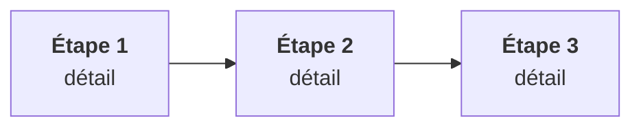

::: tldr En bref
1. **Premier message.** Une phrase de thèse, une phrase de preuve.
2. **Deuxième message.** Le mécanisme de valeur.
3. **Troisième message.** La décision et sa condition.
:::

::: kpis
- 42 % | indicateur de marché daté[^s1]
- 3x | écart observé chez les pairs[^s2]
- 120 | nombre d'actifs concernés[^s1]
- 2029 | horizon de décision
:::

## 1 — Thèse et pourquoi maintenant

Phrase d'accroche qui résume la section en une idée.
{: .lede}

Paragraphe de 2 à 5 phrases, direct et affirmatif[^s1].

| Libellé | Constat | Implication |
|---|---|---|
| Ligne 1 | Fait sourcé[^s2] | Ce que le lecteur en fait |
| Ligne 2 | Fait sourcé | Ce que le lecteur en fait |

::: cols
### Drivers de marché
- Driver 1
- Driver 2
+++
### Drivers internes
- Driver A
- Driver B
:::

::: callout Message clé
Une phrase que le lecteur doit retenir.
:::

::: callout-gold Point d'attention
Condition, risque ou arbitrage explicite.
:::

::: story Retour d'expérience
Signal daté → friction → décision humaine → capacité → mesure.
:::

[^s1]: Source 1, éditeur, date.
[^s2]: Source 2, éditeur, date.